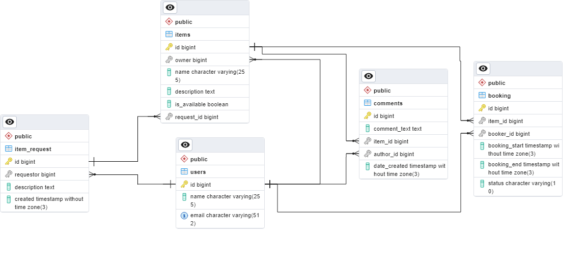

# Shareit
____
## Описание
ShareIt - приложение для аренды вещей. Платформа, которая связывает людей, которые хотят сдать свои вещи в аренду, с теми, кому они нужны на короткий период. Приложение предоставляет возможность сохранять вещи в приложении, арендовывать вещи, которые добавили другие пользователи, а также создавать запрос, если пользователь не нашел подходящую вещь. Запросы могут просматривать другие пользователи и отвечать на них, добавляя свои вещи в базу. Так же после завершения аренды, есть возможность оставить комментарий.
____
## Технологический стек.
Java 11, Spring Boot, PostgerSQL, Hibernate, JUnit, Mockito, Docker.
____
## Способ взаимодествия с приложением. 
С приложением можно взаимодействовать по протоколу HTTP. Для всех сервисов, кроме сервиса по работе с пользователями, взаимодействия 
необходимо указывать в заголовке запроса: key - X-Sharer-User-Id, value – id пользователя, который делает запрос.

Endpoints запросов:

Post /users – добавление пользователя в базу;  
Get /users/{userId} – получение пользователя по Id;  
Get /users – получение всех пользователей из базы;  
Patch /users/{userId} – обновление пользователя в базе по Id;  
Delete /users/{userId} – удаление пользователя по Id;

Post /items – добавление предмета в базу;  
Get /items/{itemId} – получение предмета по Id;  
Get /items – получение всех вещей пользователя, id которого укзано в зоголовке;  
Patch /items/{itemId} - бновление предмета по itemId;  
Get /items/search - поиск предмета по слову;  
Get /items/{itemId}/comment - добавление комментариев к вещам;  

Post /bookings - добавление бронирования;  
Patch /bookings/{bookingId} - подтверждение или отклонение запроса на бронирование c bookingId;  
Get /bookings/{bookingId} - получение данных о бронирование вещи с bookingId;   
Get /bookings - получение списка всех бронирований пользователя с userId, который указан в заголовке запроса;  
Get /bookings/owner - получение списка бронирований для всех вещей пользователя с userId, который указан в заголовке запроса;  

Post /requests - создание запроса с описание необходимого предмета;  
Get /requests - получение всех своих запросов на вещь;  
Get /requests/{requestId} - получение апроса на вещь;  
Get /requests/all - получение всех запросов на вещи.
____
## Хранение данных.
Данные хранятся в реляционной базе данных.  
БД: postgresql.  
ER - диаграмма:

